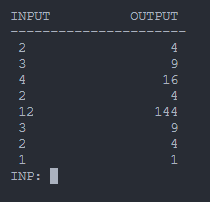

# lmc-emulator
This is an emulator for the LMC instruction set, [an instructional model of a computer modelling the von Neumann architecture](https://en.wikipedia.org/wiki/Little_man_computer). I wrote this emulator as my first proper rust project to better my skills. I implemented the instruction set according to the information on the [wiki](https://en.wikipedia.org/wiki/Little_man_computer).

> The implementation supports one-line comments "//"

## Run
> cargo run code.asm

## Showcasing i/o boxes


# [Tested examples](https://en.wikipedia.org/wiki/Little_man_computer)

## Countdown
```asm
     INP
     OUT      // Initialize output 
LOOP BRZ QUIT // Label this memory address as LOOP. If the accumulator value is 0, jump to the memory address labeled QUIT
     SUB ONE  // Subtract the value stored at address ONE from the accumulator
     OUT
     BRA LOOP // Jump (unconditionally) to the memory address labeled LOOP
QUIT HLT      // Label this memory address as QUIT
ONE  DAT 1    // Store the value 1 in this memory address, and label it ONE (variable declaration)
```

## Squaring user input until 0 is entered
```asm
START   LDA ZERO     // Initialize for multiple program run
        STA RESULT
        STA COUNT
        INP          // User provided input
        BRZ END      // Branch to program END if input = 0
        STA VALUE    // Store input as VALUE
LOOP    LDA RESULT   // Load the RESULT
        ADD VALUE    // Add VALUE, the user provided input, to RESULT
        STA RESULT   // Store the new RESULT
        LDA COUNT    // Load the COUNT
        ADD ONE      // Add ONE to the COUNT
        STA COUNT    // Store the new COUNT
        SUB VALUE    // Subtract the user provided input VALUE from COUNT
        BRZ ENDLOOP  // If zero (VALUE has been added to RESULT by VALUE times), branch to ENDLOOP
        BRA LOOP     // Branch to LOOP to continue adding VALUE to RESULT
ENDLOOP LDA RESULT   // Load RESULT
        OUT          // Output RESULT
        BRA START    // Branch to the START to initialize and get another input VALUE
END     HLT          // HALT - a zero was entered so done!
RESULT  DAT          // Computed result (defaults to 0)
COUNT   DAT          // Counter (defaults to 0)
ONE     DAT 1        // Constant, value of 1
VALUE   DAT          // User provided input, the value to be squared (defaults to 0)
ZERO    DAT          // Constant, value of 0 (defaults to 0)
```

## Quine, printing source, self-modifying
```asm
LOAD LDA 0     // Load position 0 into the accumulator. This line will be modified on each loop to load the next lines into the accumulator
     OUT       // Output the accumulator's value. The accumulator's value will be the line that was just loaded
     SUB ONE   // Subtract 1 from the value in the accumulator. This is so we can do the BRZ in the next step to see if we are on the last line in the program
     BRZ ONE   // If the previous subtraction has made the accumulator 0 (which means we had the value 001 in the accumulator), then branch to position ONE
     LDA LOAD  // Load the LOAD position into the accumulator, this is in preparation to increment the address digits for this position
     ADD ONE   // Increment the position digits for the LOAD line. The value currently in the accumulator would, if read as an instruction, load the next line into the accumulator, compared to the last line loaded
     STA LOAD  // Store the newly incremented LOAD line back in the LOAD position
     BRA LOAD  // Return to the beginning of the loop
ONE  DAT 1     // The variable ONE. If read as an instruction, this will be interpreted as HLT/COB and will end the program
```
